# BlockPro — App Screens

A visual reference of the BlockPro Flutter app, covering every main screen and its
key state variations.

> **Captured:** 25 June 2026 · **Device:** Pixel 3a (Android 12, 1080 × 2220) ·
> **Build:** v1.0.0 (1) · live screenshots from the running app with real synced data.

> **Data loading:** There is no longer a separate "initial sync" screen. After login
> the app goes straight to the Blocks list and downloads everything **in the
> background** (see [§2.1](#21-while-data-loads-background-sync)). The manual **Refresh**
> now uses that same background flow — it no longer shows a blocking progress dialog.

## Contents

1. [Onboarding & authentication](#1-onboarding--authentication)
2. [Blocks list (home)](#2-blocks-list-home)
   - [2.1 While data loads (background sync)](#21-while-data-loads-background-sync)
3. [Block inspections](#3-block-inspections)
4. [Inspection](#4-inspection)
5. [QR scanner](#5-qr-scanner)
6. [About & settings](#6-about--settings)
7. [Dialogs](#7-dialogs)

---

## 1. Onboarding & authentication

A branded welcome and the sign-in form. After signing in the user lands directly on
the Blocks list, which downloads its data in the background — there is no dedicated
sync screen.

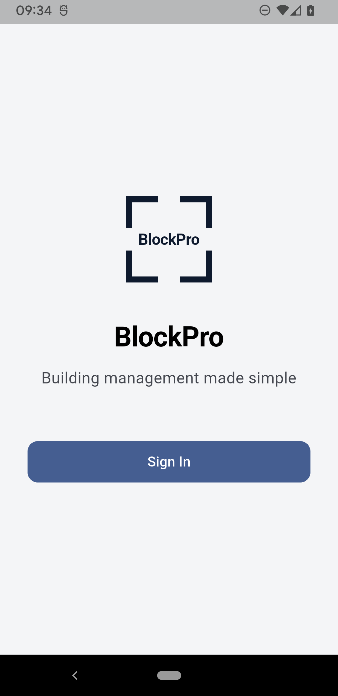 
<strong>Welcome</strong> — logo, tagline and Sign In entry point.

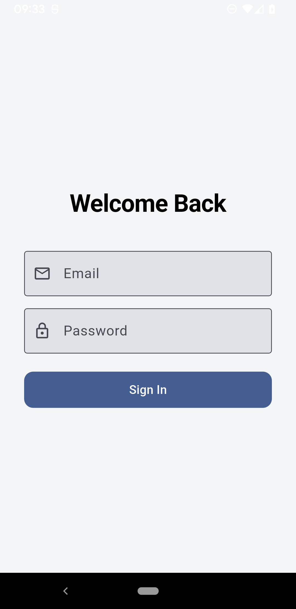 
<strong>Login</strong> — "Welcome Back" email + password form.

---

## 2. Blocks list (home)

The landing screen after login: a searchable list of buildings, each with an
overdue-inspection badge, a QR-scan FAB, and refresh / about actions in the app bar.
A building with nothing outstanding shows a green check instead of a red count.

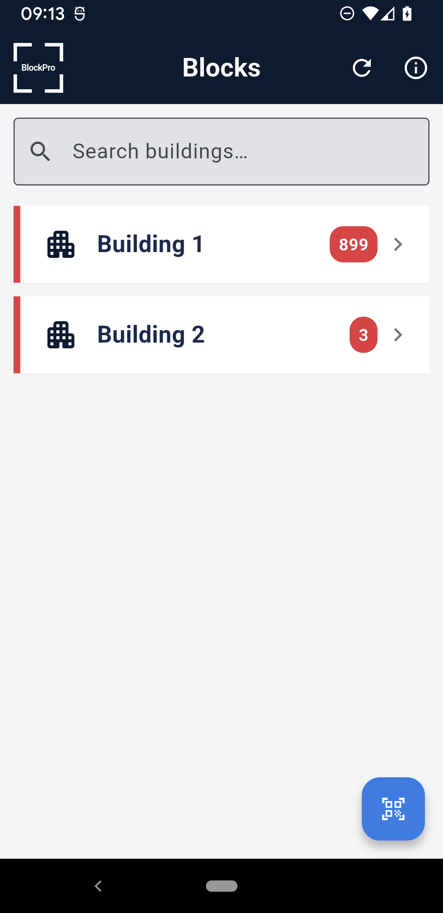 
<strong>Default</strong> — buildings with red overdue-count badges.

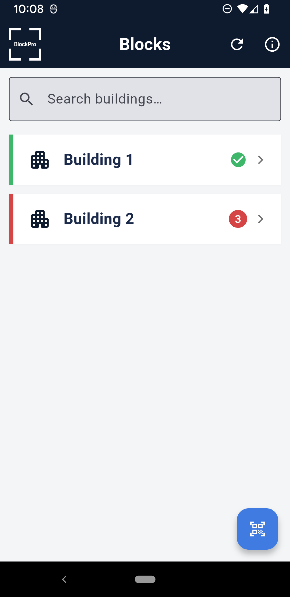 
<strong>All clear</strong> — a green check when a block has nothing due (e.g. Building 1).

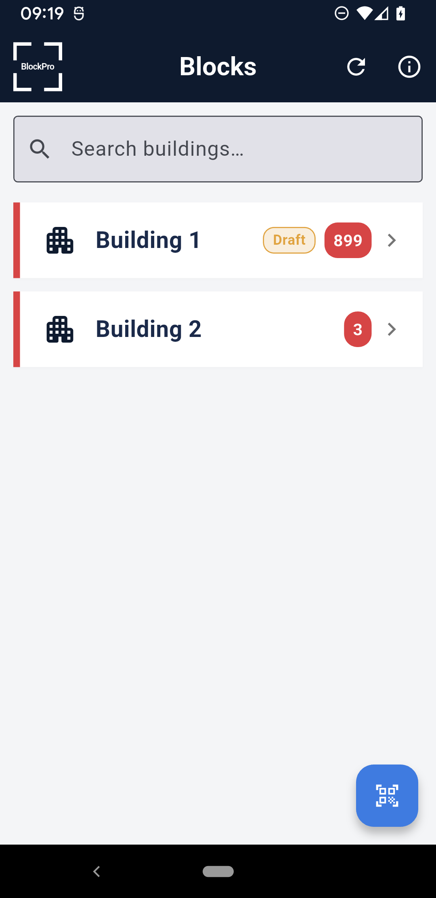 
<strong>With a draft</strong> — an amber Draft chip marks a block with an unsubmitted inspection.

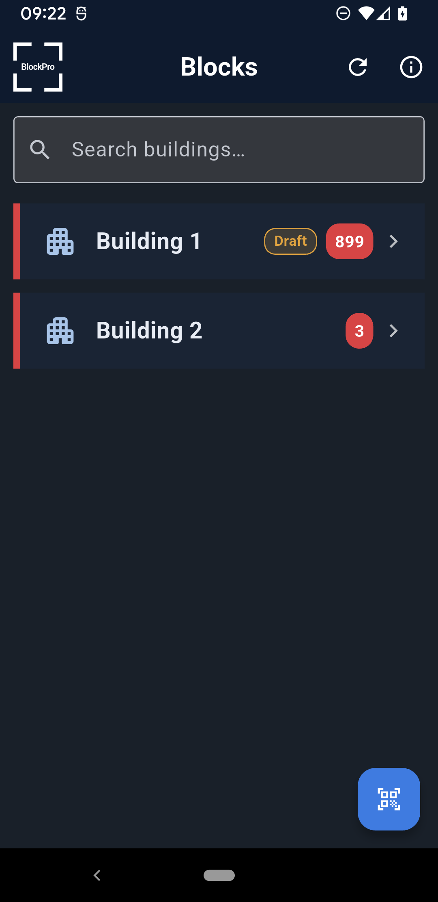 
<strong>Dark theme</strong> — full dark-mode rendering.

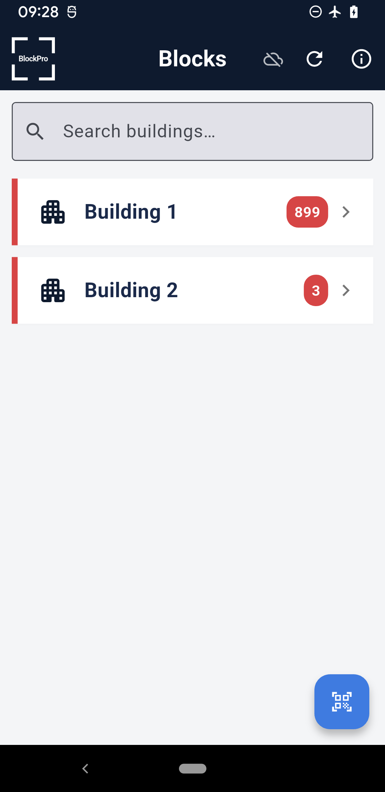 
<strong>Offline</strong> — a cloud-off icon appears in the app bar when offline.

### 2.1 While data loads (background sync)

On first launch (and after a manual Refresh) the Blocks list populates in the
background. The list stays visible the whole time:

- A brief centred spinner before any rows land.
- Each building row shows a **gray stripe and a thin loading bar** along its bottom,
  with **no badge or chevron**, and is **not tappable**, until that block's assets
  arrive. Blocks become ready independently — a small block can finish while a large
  one is still loading.
- A pulsing **cloud-download icon** ("Downloading data…") sits in the app bar on every
  screen until the sync completes. The header **Refresh** button is hidden while it runs.
- If the download fails, a SnackBar shows **"Failed to download data. Please retry."**
  with a **Retry** action.
- If a sync settles with no data, the list shows an empty state instead.

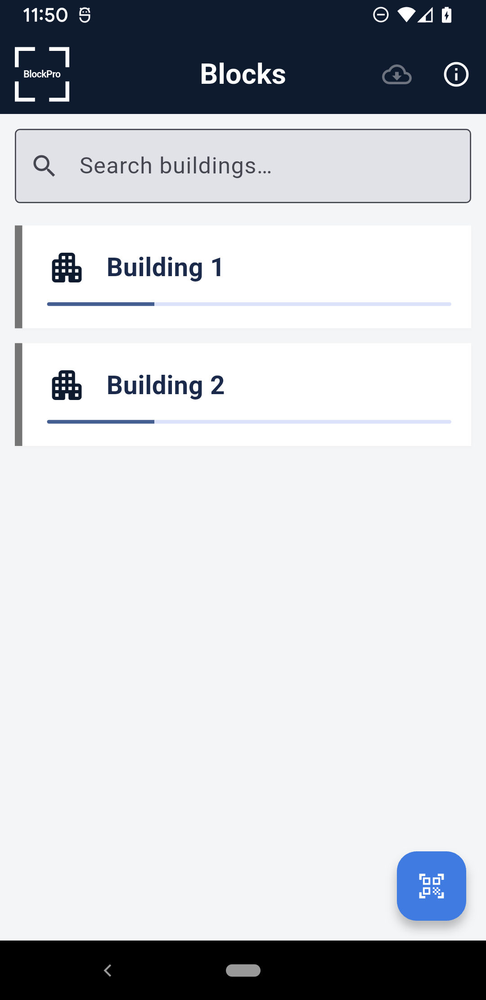 
<strong>Loading</strong> — both blocks loading: gray stripes, bottom progress bars, no badges, and the pulsing <em>Downloading data…</em> cloud icon in the app bar.

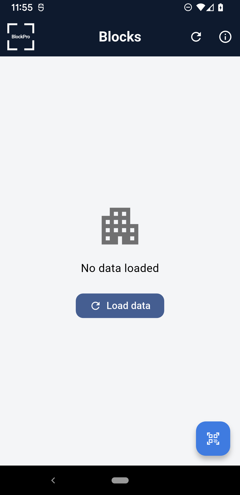 
<strong>Empty</strong> — "No data loaded" with a Load data action (wipes + re-downloads in the background).

> **Manual Refresh:** tapping the header refresh shows the [Refresh data?](#7-dialogs)
> confirmation; on confirm it wipes the local database and re-downloads everything using
> this exact background flow (no progress dialog). Offline-queued completions survive the
> wipe and are re-applied afterwards.

---

## 3. Block inspections

Inside a building: the list of inspectable assets, each showing schedule details
(last completed, frequency, next due) and a status bar (red = due/overdue). Some assets
carry extra attributes (floor/location) and an ⓘ info button.

 
<strong>Asset list</strong> — schedule details per asset with a chevron into the inspection.

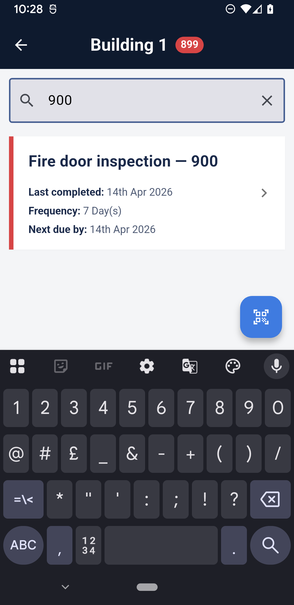 
<strong>Search</strong> — filter inspections by name/number.

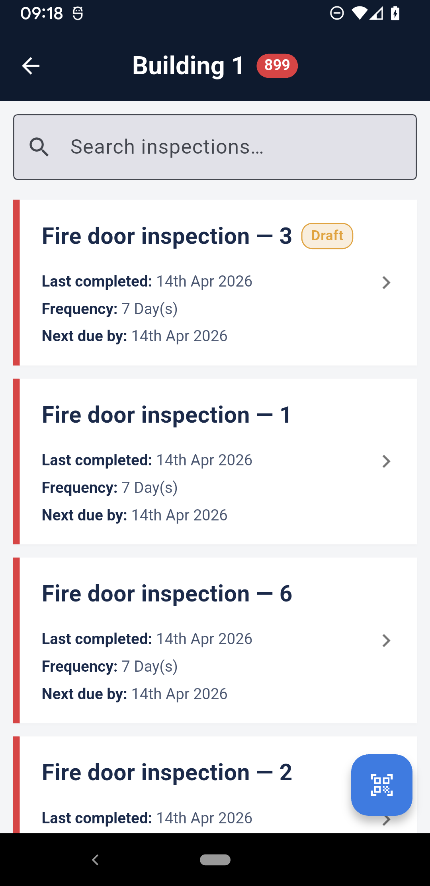 
<strong>With a draft</strong> — the in-progress asset carries a Draft chip.

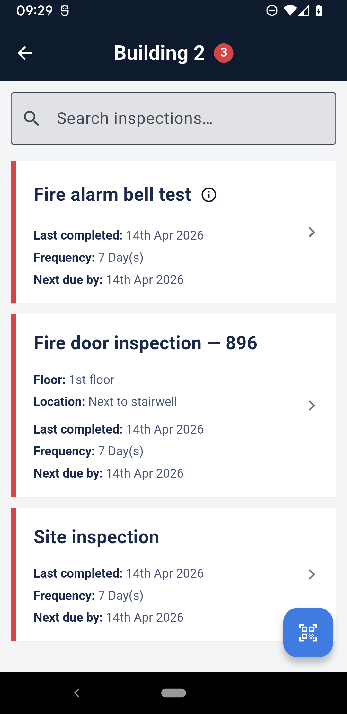 
<strong>Attributes &amp; info</strong> — optional Floor / Location, plus an ⓘ info icon for assets with help text.

---

## 4. Inspection

The core workflow screen. An optional photo-evidence header sits above a list of
checklist questions; answers, required photos and remedials are validated before
an inspection can be completed.

> **Checklist loads on open.** The first time an asset is opened its checklist is
> fetched if not already cached, showing a brief **"Downloading checklist…"** spinner
> (usually under a second, so it's not pictured here). If it can't be downloaded — for
> example when offline — the screen shows **"Unable to connect. Please check your
> internet connection."** with a **Retry** button instead of the form.

### Filling it in

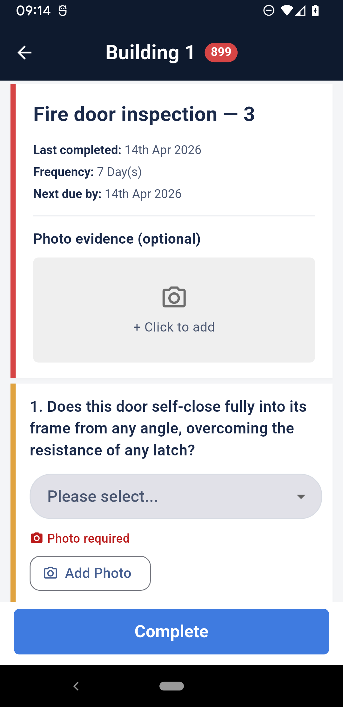 
<strong>Header &amp; first question</strong> — optional photo evidence + a question with a "Photo required" prompt.

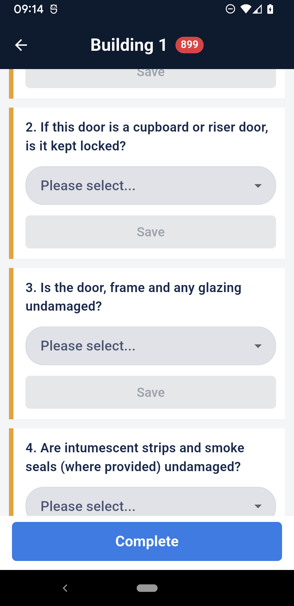 
<strong>Question list</strong> — multiple questions, each with its own answer + Save.

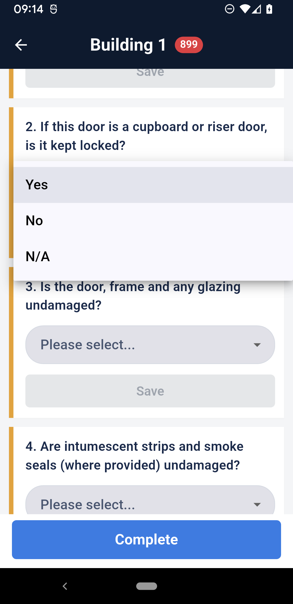 
<strong>Answer picker</strong> — tapping a field opens the Yes / No / N/A picker.

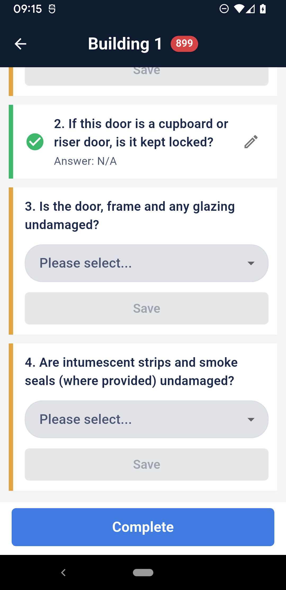 
<strong>Answered</strong> — a green tick + collapsed answer; amber bars still flag pending questions.

### Defects & dark theme

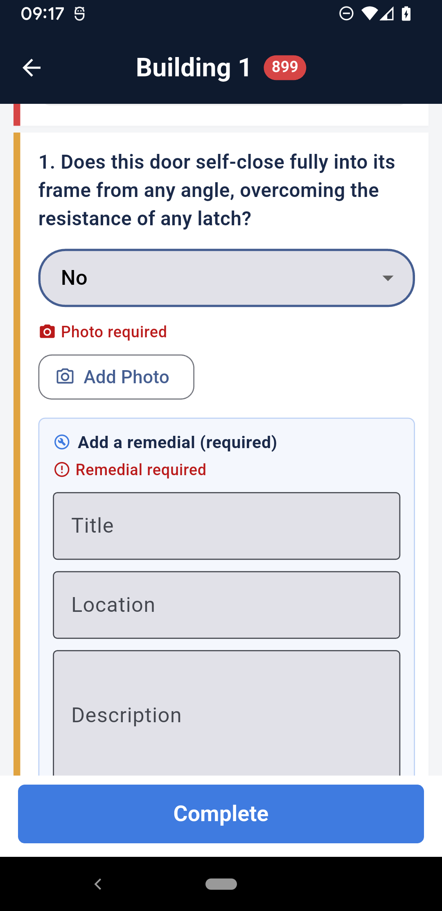 
<strong>Remedial required</strong> — a failing answer reveals a required remedial form (Title / Location / Description) and a required photo.

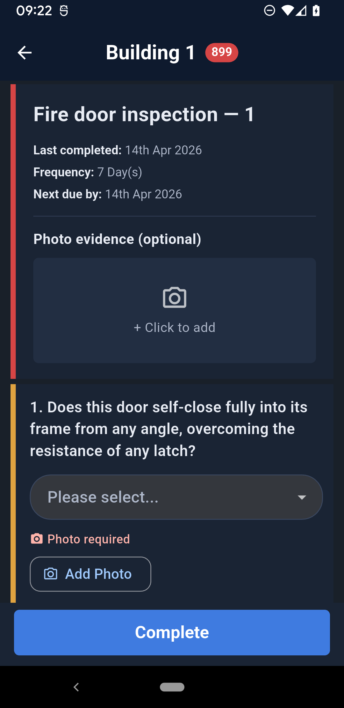 
<strong>Dark theme</strong> — the same screen in dark mode.

> Validation and draft-saving dialogs for this screen are in [§7 Dialogs](#7-dialogs).

---

## 5. QR scanner

Reached from the FAB. Scanning an asset's QR code jumps straight to its inspection.

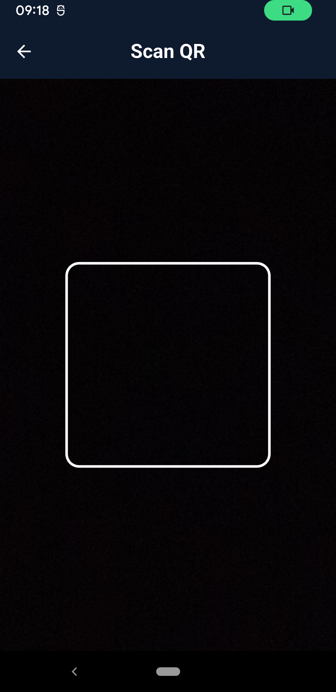 
<strong>Scan QR</strong> — viewfinder for scanning an asset's code.

---

## 6. About & settings

App info, appearance (System / Light / Dark), version, sign-out, and a debug
data-audit action.

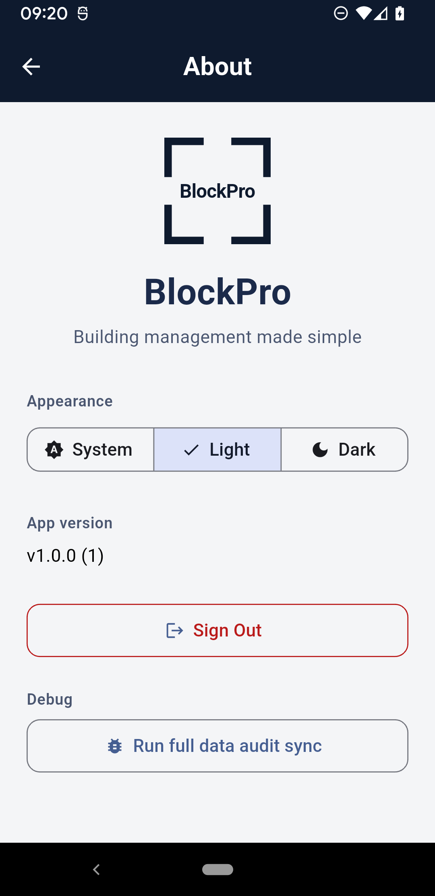 
<strong>About — light</strong>

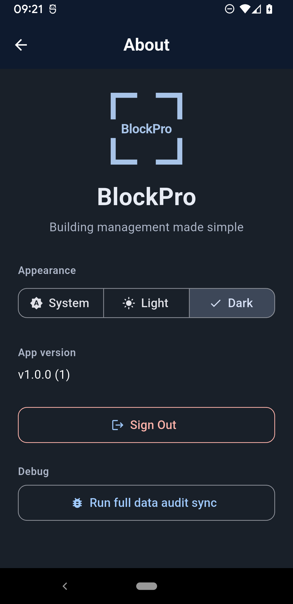 
<strong>About — dark</strong>

---

## 7. Dialogs

Modal confirmations used across the app.

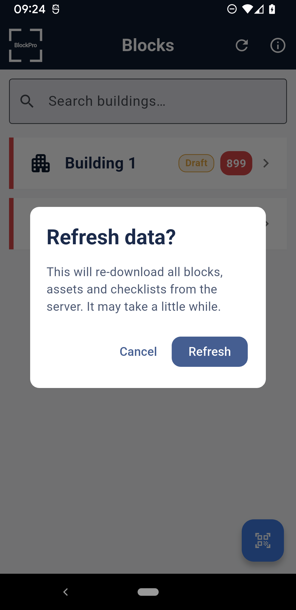 
<strong>Refresh data?</strong> — confirm a full re-download. The refresh then runs in the background (see <a href="#21-while-data-loads-background-sync">§2.1</a>) — there is no progress dialog.

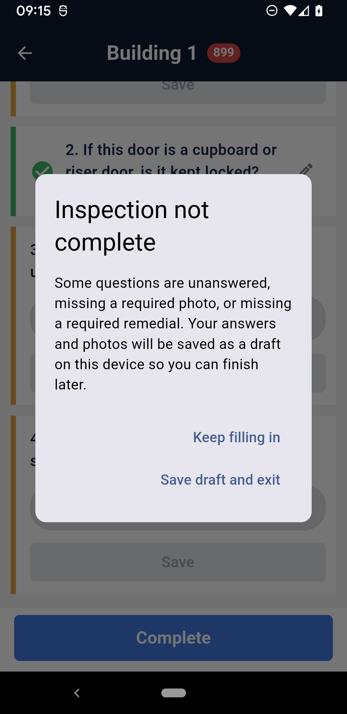 
<strong>Inspection not complete</strong> — blocks completion when answers/photos/remedials are missing.

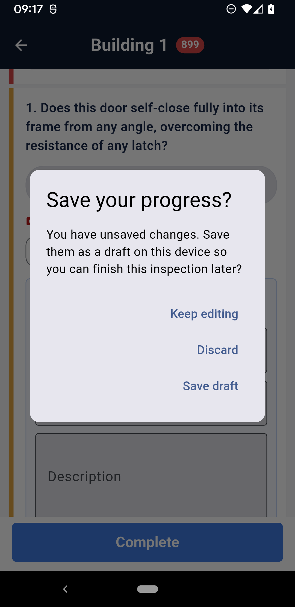 
<strong>Save your progress?</strong> — Keep editing / Discard / Save draft when leaving an unfinished inspection.

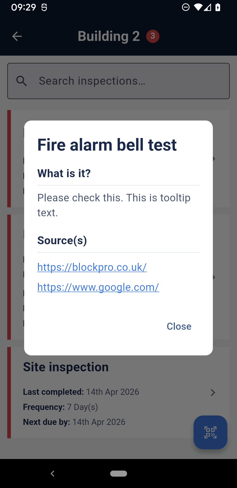 
<strong>Asset info</strong> — "What is it?" help text and source links for an asset.

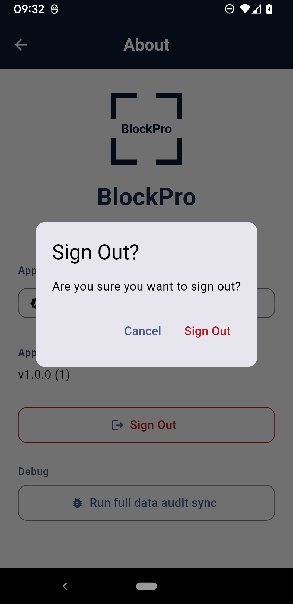 
<strong>Sign out?</strong> — confirmation before signing out and wiping local data.

---

*Screenshots live in [`docs/screenshots/`](screenshots/). To regenerate the captures, run
the app on a connected device and recapture with `adb exec-out screencap`. To rebuild the
PDF: `md-to-pdf --stylesheet app-screens.css app-screens.md` (run from `docs/`).*
